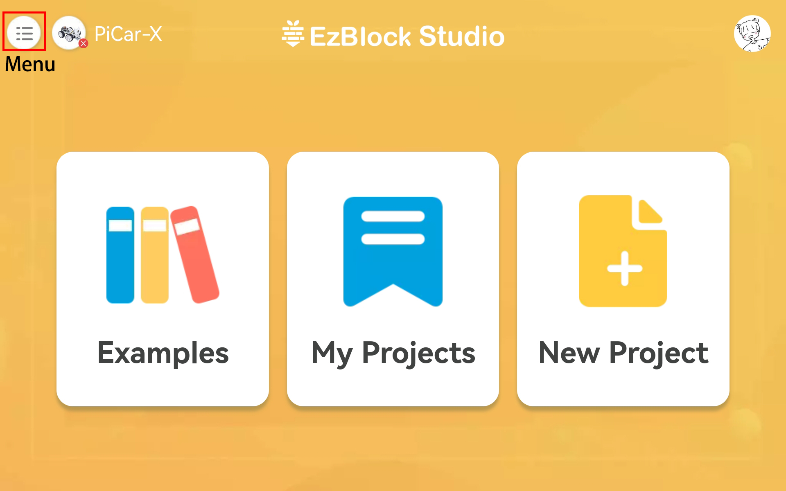
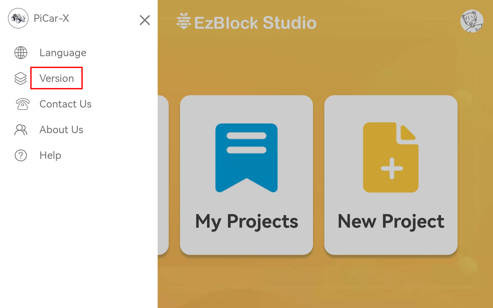

FAQ
============

Check the APP Version
-----------------------------

Confirm the app version by the following method, and then go to the FAQ of different versions.

Click the **Menu** button in the upper left corner.

Then click the **Version** button.

Now you can view the version.

.. note::
    If it is EzBlock 3.0, it is recommended to update to the new version, for a detailed tutorial please refer to: :ref:`quick_guide_3.1`.

    .. image:: img/ezblock3.1/app_version.jpg
        :align: center

EzBlock Studio 3.1
--------------------------

Q1. APP can't search Bluetooth
    * Power on the product and see if there is pleasant music (not only current "zi~" sound). If not, please :ref:`ezblock_os_3.1` again.
    * whether the Bluetooth of your mobile device is turned on or not.
    * Whether the app is allowed to access the device's location.
    * Some mobile devices also require location services to be turned on.
    * Check the power level. If both power indicators are off, or only one is blinking; the power level is low, please charge the batteries.
    * If all the above methods have been tried, try to press RST button, or restart the product and APP.

Q2. The APP searches for Bluetooth, but cannot connect
    * Power on the product and see if there is pleasant music (not only current "zi~" sound). If not, please :ref:`ezblock_os_3.1` again.
    * Check if the BLE or USR light on ROBOT HAT is always on (which means the product is connected by other devices), if yes, disconnect the other devices or restart the product.
    * If all the above methods have been tried, try to press RST button, or restart the product and APP.

Q3. APP can't connect after configuring WIFI
    * Check if the country, SSID and PSK are correct.
    * Check the network status of this WIFI.
    * Check the power level. If both power indicators are off or only one power indicator is blinking; the power level is low, please charge the batteries.
    * Check whether the configured WiFi and the Wi-Fi connected by the mobile device are the same.

EzBlock Studio 3.0
-------------------------------

.. note::
    EzBlock Studio has been updated to version 3.1, it is recommended to update to the new version, for a detailed tutorial please refer to: :ref:`quick_guide_3.1`.

Q1. APP can't search Bluetooth
    * Turn on the product, after the current "zi~" sound, another piece of pleasant music appears; it means that EzBlock OS is downloaded incorrectly, please refer to :ref:`ezblock_os_3.0` to install the correct one.
    * whether the Bluetooth of your mobile device is turned on or not.
    * Whether the app is allowed to access the device's location.
    * Some mobile devices also require location services to be turned on.
    * Check the power level. If both power indicators are off, or only one is blinking; the power level is low, please charge the batteries.
    * If all the above methods have been tried, try to press RST button, or restart the product and APP.

Q2. The APP searches for Bluetooth, but cannot connect
    * Turn on the product, after the current "zi~" sound, another piece of pleasant music appears; it means that EzBlock OS is downloaded incorrectly, please refer to :ref:`ezblock_os_3.0` to install the correct one.
    * Check if the BLE or USR light on ROBOT HAT is always on (which means the product is connected by other devices), if yes, disconnect the other devices or restart the product.
    * If all the above methods have been tried, try to press RST button, or restart the product and APP.

Q3. APP can't connect after configuring WIFI
    * Check if the country, SSID and PSK are correct.
    * Check the network status of this WIFI.
    * Check the power level. If both power indicators are off or only one power indicator is blinking; the power level is low, please charge the batteries.
    * Check whether the configured WiFi and the Wi-Fi connected by the mobile device are the same.
