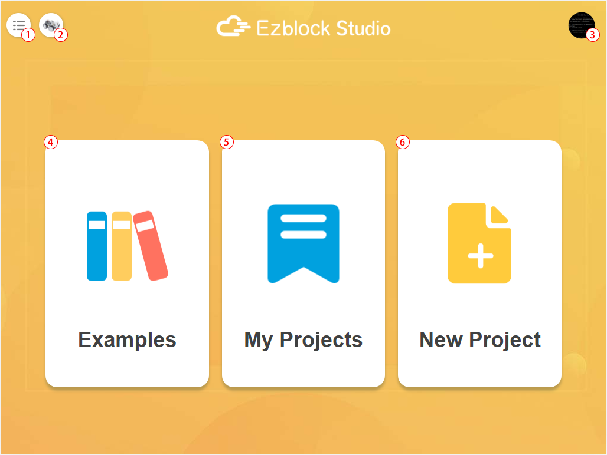
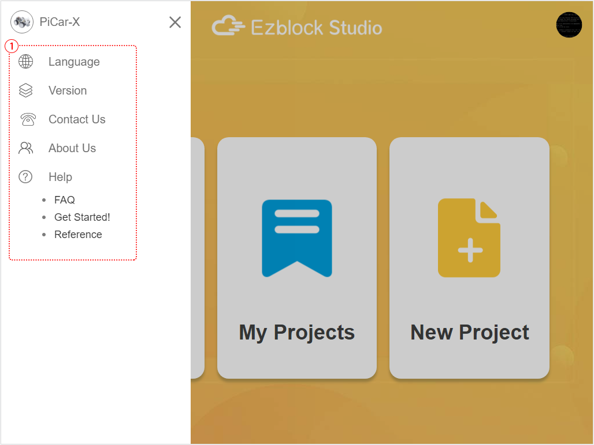
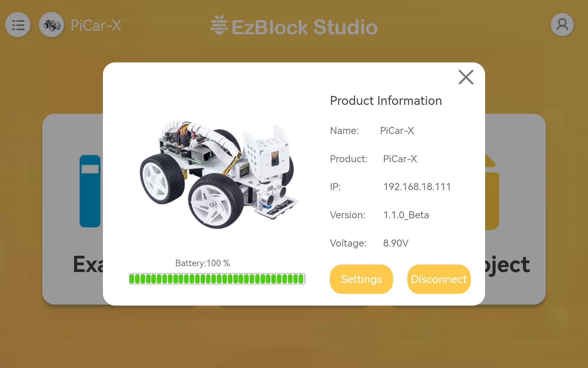
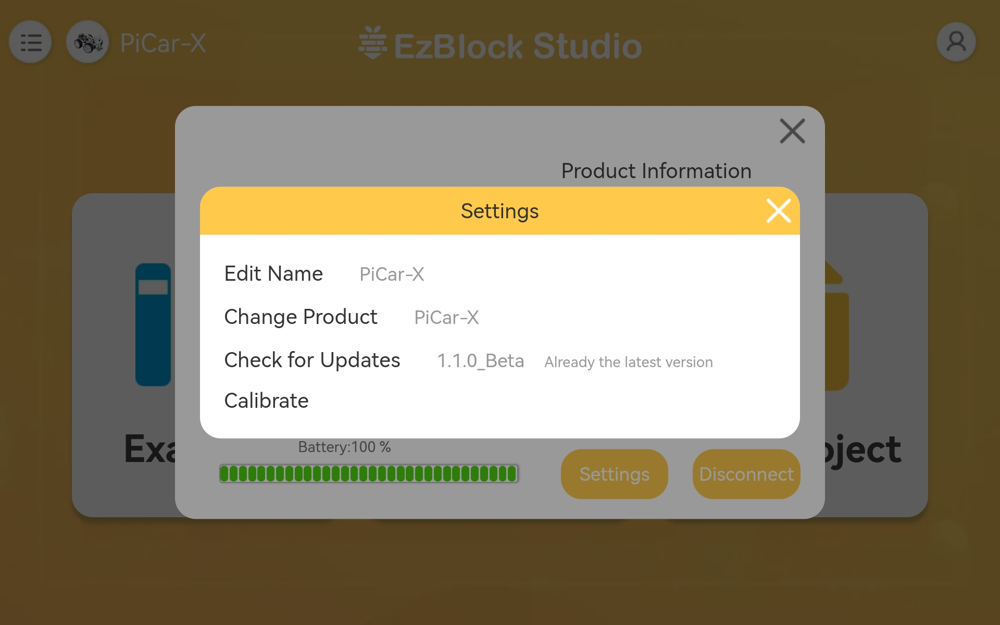
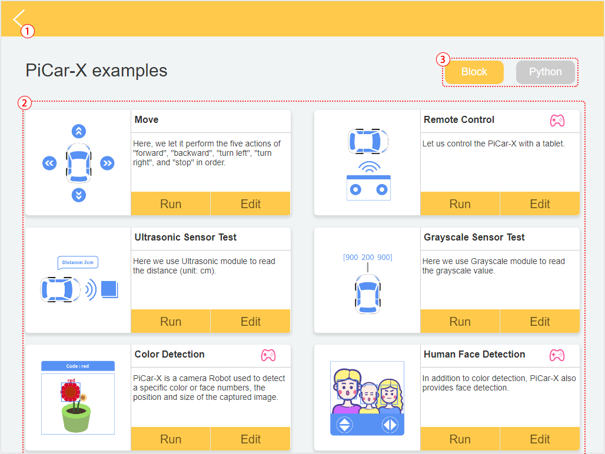
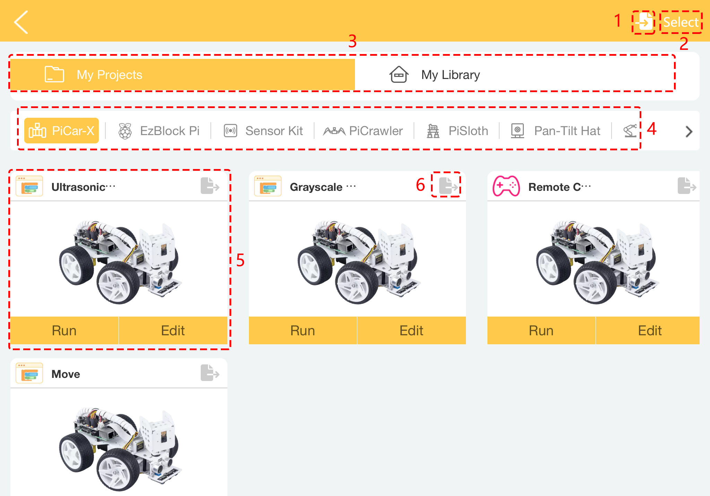
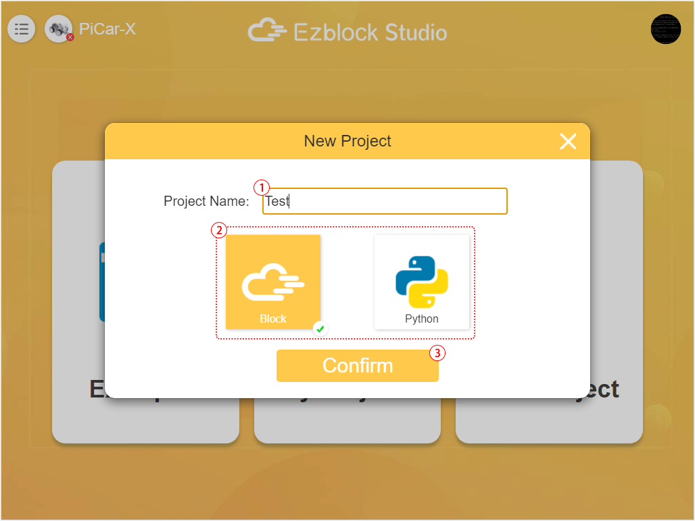

.. note::

    こんにちは、SunFounderのRaspberry Pi & Arduino & ESP32愛好家コミュニティへようこそ！Facebook上でRaspberry Pi、Arduino、ESP32についてもっと深く掘り下げ、他の愛好家と交流しましょう。

    **参加する理由は？**

    - **エキスパートサポート**：コミュニティやチームの助けを借りて、販売後の問題や技術的な課題を解決します。
    - **学び＆共有**：ヒントやチュートリアルを交換してスキルを向上させましょう。
    - **独占的なプレビュー**：新製品の発表や先行プレビューに早期アクセスしましょう。
    - **特別割引**：最新製品の独占割引をお楽しみください。
    - **祭りのプロモーションとギフト**：ギフトや祝日のプロモーションに参加しましょう。

    👉 私たちと一緒に探索し、創造する準備はできていますか？[|link_sf_facebook|]をクリックして今すぐ参加しましょう！

ホームページ
===================

EzBlockを開くと、以下のようなホームページが表示されます：

* :ref:`home_menu`: クリックすると、メニューウィンドウが表示されます。
* :ref:`home_product`: ここからロボットを接続してください。具体的な操作については、:ref:`quick_guide_latest` と :ref:`use_on_web_latest` をご参照ください。
* **3. プロフィール**: バージョン3.2以降、アカウントの登録やログインは不要となり、このアイコンは削除されます。
* :ref:`home_examples`: こちらで予設の例を確認して、すぐに試してみることができます。
* :ref:`home_myprojects`: あなたのパーソナルプロジェクトやライブラリはここに保存されます。
* :ref:`home_newproject`: 新しいプロジェクトを作成。
* :ref:`import_project_library`: プロジェクトやライブラリをインポートするために使用します。

.. _home_menu:

1. メニュー
-------------------------

* 言語: 中国語と英語を含む。
* バージョン: 現在のバージョンを確認。
* お問い合わせ: 質問がある場合は、こちらからヘルプを求めることができます。
* 会社概要: SunFounderの紹介。
* ヘルプ: 選択すると、EzBlock関連のチュートリアルが表示されます。FAQ、入門ガイド、 `リファレンス <https://docs.ezblock.cc/en/latest/reference.html>`_ などが含まれます。

.. _home_product:

2. 製品
------------------

**製品情報**

製品情報ページです。製品名（あなたが命名したもの）、製品タイプ、Raspberry PiのIP、APPのバージョン、動作電圧、製品の現在の電力を表示しています。

**設定**

* **Edit Name**: 以前につけた名前に満足していない場合、ここで変更することができます。
* **Change Product**: 他の製品に変更します。
* **Check for Updates**: アプリの現在のバージョンを確認し、新しいバージョンがあるかどうかを確認します。
* **Calibrate**: 使用中に製品が少し偏っていると感じた場合、このボタンを使用して正しい位置に再調整することができます。
  
.. 3. Profile
.. ------------------

.. This feature will be canceled after version 3.2.

.. The Profile interface is as follows:

.. .. image:: img/sp210805_140821.png

.. 1. Long press to edit profile picture.
.. 2. Click Edit at the bottom right to edit personal information.
.. 3. Your personal projects are saved here, you can also enter here from the homepage.
.. 4. Your personal library.
.. 5. Modify email, password or delete account here.
.. 6. Log out.

.. **My Project**

.. .. image:: img/sp210805_140940.png

.. 1. Your project will be saved under the corresponding product category, switch the product category here.
.. 2. Choose your personal project here. Click Run to flash and run the program directly (if the project uses remote control, it will also enter the remote control interface), click edit to enter the programming interface.

.. **My Library**

.. .. image:: img/sp210805_141703.png

.. The information of the library you have saved will be displayed here. If you want to use it, you need to import it from a specific project.

.. **Security**

.. .. image:: img/sp210805_141840.png

.. Modify email, password or delete account here.

.. _home_examples:

4. 例
-------------------

1. ホームページに戻る
2. 例を選択します。 **Run** をクリックすると、プログラムが直接フラッシュおよび実行され、 **Edit** をクリックすると、プログラミングインターフェイスに入ります。
3. プログラミング言語を選択するには、BlocklyとPythonの2つのオプションがあります。

.. note::

    Examplesページに入る前に、正しい製品を選択する必要があります。

.. _home_myprojects:

5. マイプロジェクト
---------------------

1. プロジェクトやライブラリをインポートします。
2. 選択ボタン: クリックすると、複数のプロジェクトやライブラリを一度に選択する、またはすべてをエクスポートまたは削除するために選択することができます。
3. ここには「マイプロジェクト」と「マイライブラリ」の2つのカテゴリがあります。
4. あなたのプロジェクトは、対応する製品カテゴリの下に保存されます。
5. あなたのパーソナルプロジェクトをここで選択してください。 **Run** をクリックすると、プログラムが直接フラッシュおよび実行され、リモートコントロールを使用している場合はリモートコントロールページにも移動します。 **Edit** をクリックすると、プログラミングページに入ります。
6. 各プロジェクトやライブラリの右上にエクスポートアイコンがあります。

.. _home_newproject:

6. 新しいプロジェクト
-----------------------

1. プロジェクトの名前を入力します。
2. プログラミング言語を選択するには、BlocklyとPythonの2つのオプションがあります。
3. プログラミングインターフェイスに入るにはクリックします。

