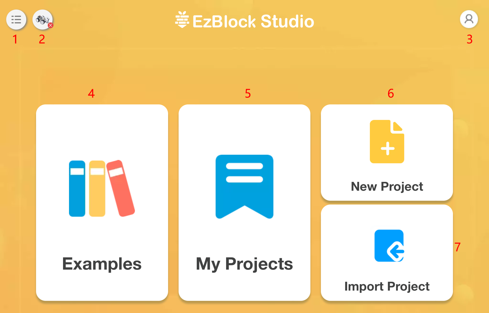

Startseite
===================

Wenn wir EzBlock öffnen, sehen wir die Startseite, wie unten dargestellt:

* :ref:`home_menu`: Nach dem Anklicken öffnet sich ein Menüfenster.
* :ref:`home_product`: Verbinden Sie hier Ihren Roboter. Siehe :ref:`quick_guide_latest` und :ref:`use_on_web_latest` für spezifische Vorgänge.
* **3. Profil**: Ab Version 3.2 müssen Sie sich nicht mehr registrieren oder in Ihrem Konto anmelden, und dieses Symbol wird entfernt.
* :ref:`home_examples`: Hier können Sie die voreingestellten Beispiele ansehen, um schnell loszulegen.
* :ref:`home_myprojects`: Ihr persönliches Projekt oder Bibliothek wird hier gespeichert.
* :ref:`home_newproject`: Erstellen Sie ein neues Projekt.
* :ref:`import_project_library`: Wird verwendet, um Projekte oder Bibliotheken zu importieren.

.. _home_menu:

1. Menü
-------------------------

.. image:: img/sp210805_140425.png

* Sprache: Chinesisch und Englisch sind enthalten.
* Version: Anzeigen der aktuellen Version.
* Kontaktieren Sie uns: Bei Fragen können Sie hier um Hilfe bitten.
* Über uns: Vorstellung von SunFounder.
* Hilfe: Bei Auswahl werden EzBlock-bezogene Tutorials angezeigt, einschließlich FAQ, Einführung und `Referenz <https://docs.ezblock.cc/en/latest/reference.html>`_.

.. _home_product:

2. Produkt
------------------

**Product Information**

.. image:: img/product_page.jpg
    :align: center

Dies ist die Produktinformationsseite, die den Produktnamen (den Sie vergeben), den Produkttyp, die Raspberry Pi IP, die APP-Version, die Betriebsspannung und die aktuelle Leistung des Produkts enthält.

**Settings**

.. image:: img/settings.jpg
    :align: center

* **Edit Name**: Wenn Sie mit dem zuvor vergebenen Namen nicht zufrieden sind, können Sie ihn hier ändern.
* **Change Product**: Zu einem anderen Produkt wechseln.
* **Check for Updates**: Überprüfen Sie die aktuelle Version der App und sehen Sie nach, ob eine neuere Version verfügbar ist.
* **Calibrate**: Wenn Sie denken, dass Ihr Produkt während des Gebrauchs noch etwas abweicht, können Sie mit dieser Schaltfläche eine Neukalibrierung vornehmen.

.. 3. Profil
.. ------------------

.. Dieses Feature wird nach der Version 3.2 abgeschafft.

.. Das Profil-Interface sieht wie folgt aus:

.. .. image:: img/sp210805_140821.png

.. 1. Längeres Drücken zum Bearbeiten des Profilbildes.
.. 2. Klicken Sie unten rechts auf Bearbeiten, um persönliche Informationen zu ändern.
.. 3. Ihre persönlichen Projekte werden hier gespeichert, Sie können auch von der Startseite aus hierher gelangen.
.. 4. Ihre persönliche Bibliothek.
.. 5. Ändern Sie hier E-Mail, Passwort oder löschen Sie das Konto.
.. 6. Abmelden.

.. **Mein Projekt**

.. .. image:: img/sp210805_140940.png

.. 1. Ihr Projekt wird unter der entsprechenden Produktkategorie gespeichert, wechseln Sie hier die Produktkategorie.
.. 2. Wählen Sie hier Ihr persönliches Projekt. Klicken Sie auf Ausführen, um das Programm direkt zu flashen und auszuführen (wenn das Projekt eine Fernsteuerung verwendet, wird auch das Fernsteuerungsinterface geöffnet), klicken Sie auf Bearbeiten, um zur Programmierschnittstelle zu gelangen.

.. **Meine Bibliothek**

.. .. image:: img/sp210805_141703.png

.. Die Informationen der gespeicherten Bibliothek werden hier angezeigt. Wenn Sie sie verwenden möchten, müssen Sie sie aus einem spezifischen Projekt importieren.

.. **Sicherheit**

.. .. image:: img/sp210805_141840.png

.. Ändern Sie hier E-Mail, Passwort oder löschen Sie das Konto.

.. _home_examples:

4. Beispiele
-------------------

.. image:: img/sp210805_135846.png

1. Zurück zur Startseite
2. Ein Beispiel auswählen. Klicken Sie auf Ausführen, um das Programm direkt zu flashen und auszuführen, und klicken Sie auf Bearbeiten, um zur Programmierschnittstelle zu gelangen.
3. Um eine Programmiersprache zu wählen, gibt es zwei Optionen: Blockly und Python.

.. note::

    Bevor Sie die Beispiele-Seite betreten, müssen Sie zuerst das korrekte Produkt auswählen.

.. _home_myprojects:

5. Meine Projekte
-----------------

1. Projekte oder Bibliotheken importieren.
2. Auswahl-Button: Nach dem Klicken können Sie mehrere Projekte oder Bibliotheken auf einmal auswählen oder alle auswählen, um zu exportieren oder zu löschen.
3. Hier gibt es zwei Kategorien: Meine Projekte oder Meine Bibliothek.
4. Ihr Projekt wird unter der entsprechenden Produktkategorie gespeichert.
5. Wählen Sie hier Ihr persönliches Projekt aus. Sie können auf **Run** klicken, um das Programm direkt zu flashen und auszuführen (wenn das Projekt eine Fernsteuerung verwendet, werden Sie auch zur Fernsteuerungsseite weitergeleitet), und auf **Edit** klicken, um zur Programmierseite zu gelangen.
6. Das Export-Symbol befindet sich in der oberen rechten Ecke jedes Projekts oder jeder Bibliothek.

.. _home_newproject:

6. Neues Projekt
--------------------

.. image:: img/sp210805_143611.png

1. Geben Sie den Namen des Projekts ein.
2. Um eine Programmiersprache zu wählen, gibt es zwei Optionen: Blockly und Python.
3. Klicken, um zur Programmierschnittstelle zu gelangen.

