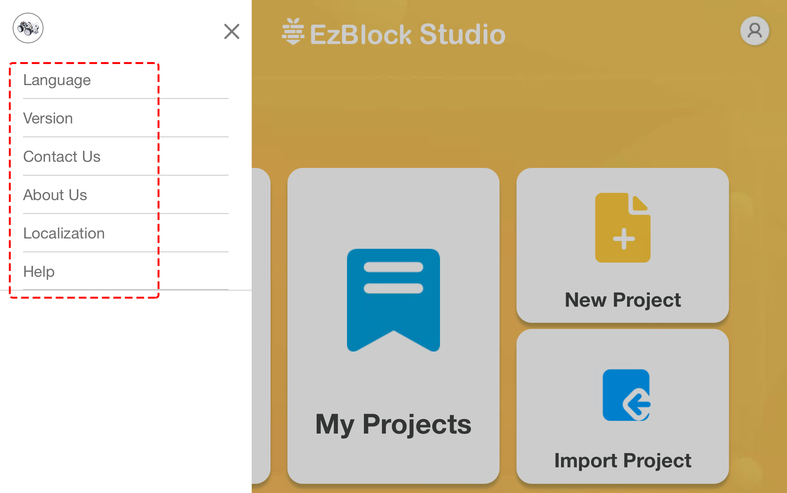

Home Page
===================

When we open ezblock, we can see the homepage, as shown below:

.. image:: img/sp210805_135127.png

1. Menu : After clicking, a menu window will pop up.
2. Product: Connect your robot from here, please see :ref:`Quick User Guide for Ezblock 3` and :ref:`How to Use Ezblock Studio on the Web` for specific operations.
3. Profile : Enter the Profile interface from here, please see :ref:`Profile` for details.
4. Examples : You can view the preset examples here to let you play quickly.
5. My Projects : Your personal project is saved here, and you can also enter the My Project interface from the Profile interface.
6. New project : Create a new project.

**Menu**

* Language: Chinese and English are included.
* Version: View the current version. You can also switch between Ezblock2.0 and 3.0 here.
* Contact us: If you have any questions, you can ask for help here.
* About Us: Introduction to SunFounder.
* Help: When selected, ezblock related tutorials will pop up, including FAQ, get started and `reference <https://docs.ezblock.cc/en/latest/reference.html>`_.

**Examples**

.. image:: img/sp210805_135846.png

1. Back to home page
2. Choose an example. Click Run to flash and run the program directly, and click Edit to enter the programming interface.
3. To choose a programming language, there are two options: Blockly and Python.

.. note::

    Before entering the Examples page, you need to select the correct product first.

**New Project**

.. image:: img/sp210805_143611.png

1. Enter the name of the project.
2. To choose a programming language, there are two options: Blockly and Python.
3. Click to enter the programming interface.

