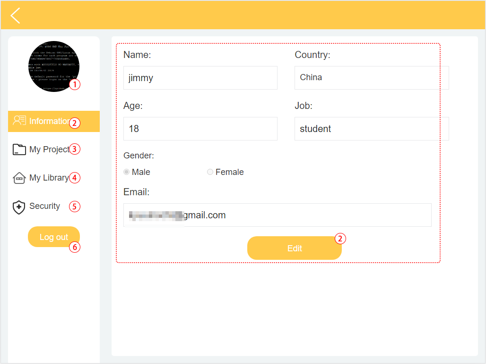
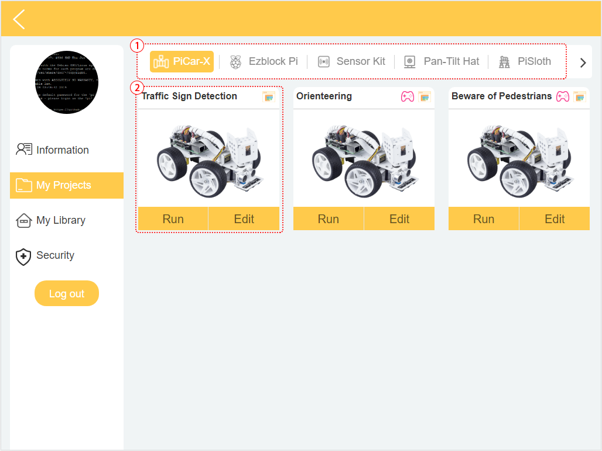
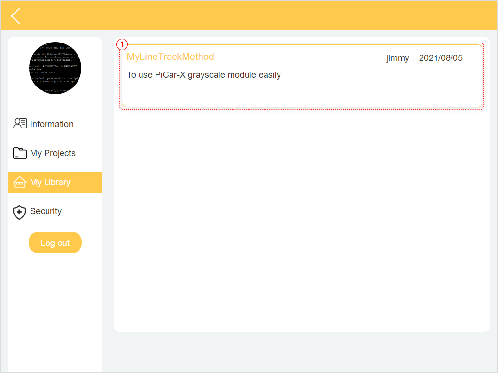
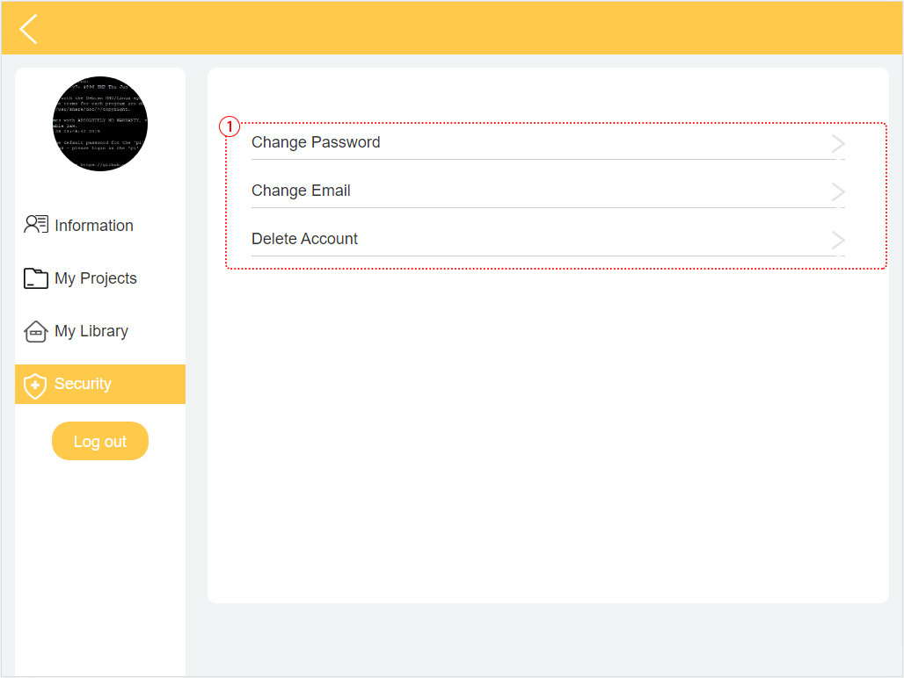

Profile
======================

The Profile interface is as follows:

1. Long press to edit profile picture.
2. Click Edit at the bottom right to edit personal information.
3. Your personal projects are saved here, you can also enter here from the homepage.
4. Your personal library.
5. Modify email, password or delete account here.
6. Log out.

**my project**

1. Your project will be saved under the corresponding product category, switch the product category here.
2. Choose your personal project here. Click Run to flash and run the program directly (if the project uses remote control, it will also enter the remote control interface), click edit to enter the programming interface.

**my library**

The information of the library you have saved will be displayed here. If you want to use it, you need to import it from a specific project.

**security**

Modify email, password or delete account here.