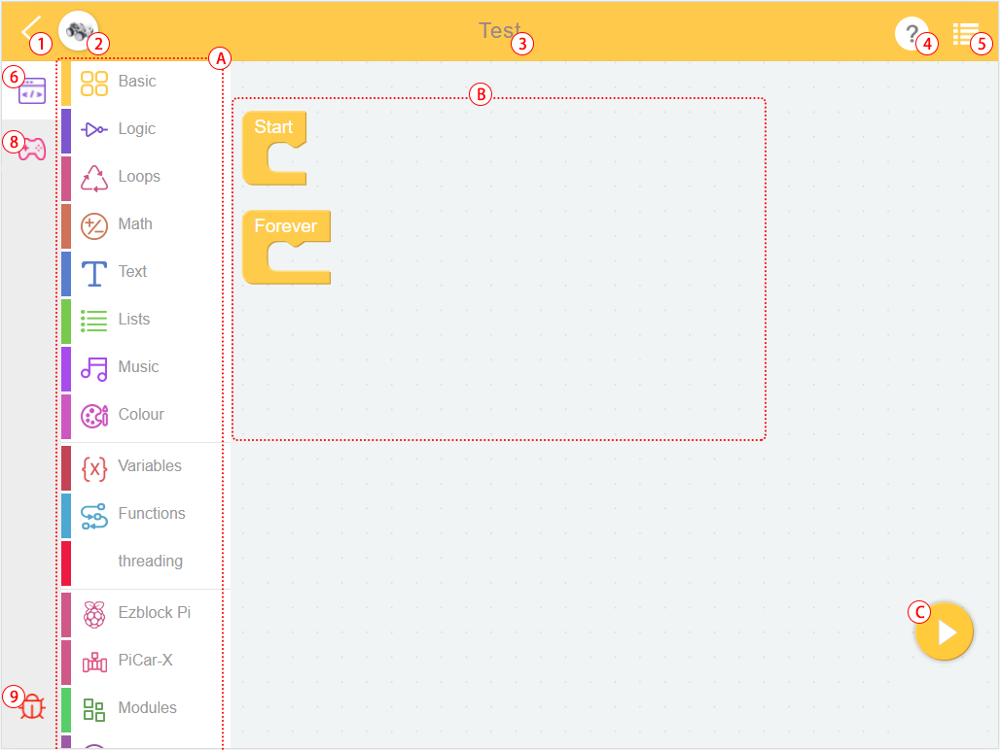
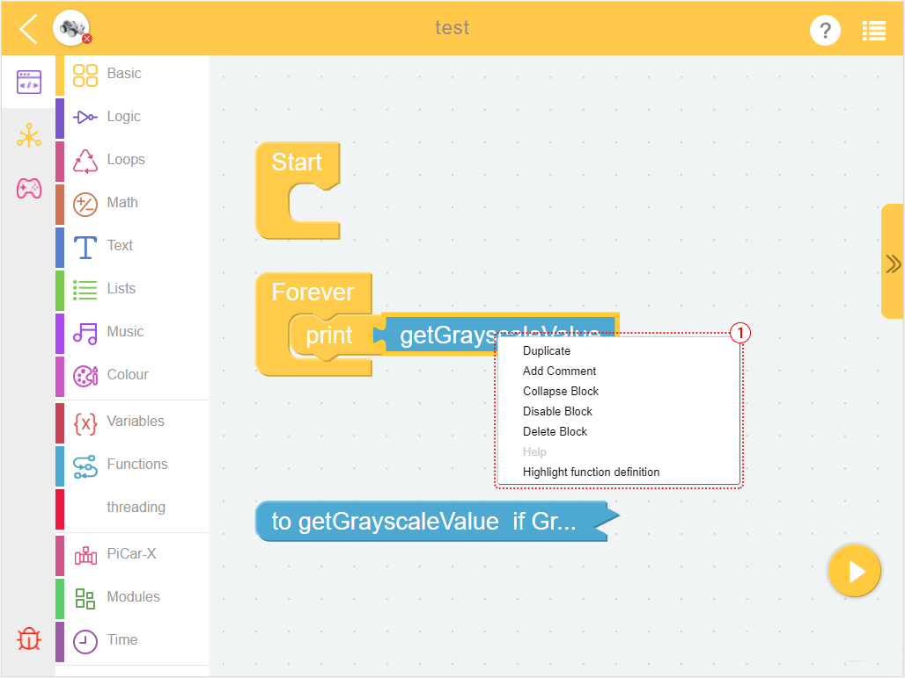

.. _programming_block:

プログラミングページ
==========================

コードを書く際（新しいプロジェクトを作成、例を編集、個人のプロジェクトを編集する際）には、プログラミングページに入ります。
ここにはBlockly言語でのプログラミングインターフェースが示されています。Python言語でのプログラミングについては、 :ref:`programming_python` を参照してください。

1. ホームページに戻る
2. 製品を選ぶ
3. プロジェクト名
4. ヘルプ
5. メニュー
6. プログラミングインターフェース

7. リモートコントロールインターフェース
8. デバッグモニター

A. ブロックのカテゴリ
B. プログラミングエリア
C. 実行
D. フラッシュ＆実行

**ブロックのカテゴリ**

.. image:: img/sp210805_151353.png

ここからコードブロックを見つけて、プログラミングのためにプログラミングエリアにドラッグします。具体的な使用法は `Block Reference <https://docs.ezblock.cc/en/latest/reference-for-block/block.html>`_ で確認してください。

**デバッグモニター**

右下隅のデバッグアイコンをクリックすると、移動可能なデバッグモニターが表示されます。**print** ブロックのテキストがここに表示されます。

**ヘルプ**

選択後、ezblockのチュートリアルが表示されます。FAQ、取り始め、および `reference <https://docs.ezblock.cc/en/latest/reference.html>`_ を含む。

**メニュー**

.. image:: img/sp210805_150436.png

* **New Project**：新しいプロジェクトを作成するために使用します。
* **My Projects**：このボタンを使用して、 **My Projects** ページに移動して、プロジェクトやライブラリを表示、エクスポート、またはインポートします。
* **Save**：プロジェクトを **My Projects** に追加します。
* **Save As**：プロジェクトは新しいファイル名として **My Projects** ページに保存されます。
* **Create Library**：プロジェクト内の関数を選択してライブラリを作成します。詳しいチュートリアルについては、 :ref:`library_function_latest` を参照してください。
* **Import Library**：保存されたライブラリをインポートします。
* **Save As File**：デバイスのフォルダに保存します。EzBlock StudioのWebアクセスを使用している場合、プロジェクト(``.ezbpro``)はコンピュータにダウンロードされます。モバイルデバイスを使用する場合、アプリを使用してプロジェクト(``.ezbpro``)をデバイスのフォルダに保存するか、それを共有することができます。

**TIPS**

プログラミングエリアやブロックを長押しすることで、いくつかの補助機能を使用できます。

.. image:: img/sp210805_151610.png

.. list-table:: ブロックのメニュー

    * - **オプション**
      - **説明**
    * - Duplicate 
      - 選択したブロック（およびその支配下のブロック）をコピーします。
    * - Add/Remove Comment
      - クリックすると、ブロックの右上に``?``アイコンが表示されます。これは、コードの読み取りに役立つテキストを書き込むためのものです。これらのテキストはプログラムによって実行されません。
    * - Expand/Conllapse Block
      - コードにより多くのブロックがある場合、それらを収縮させ、必要に応じて展開することができます。
    * - Disable/Enable Block
      - この機能は、プログラムを変更せずに特定のブロックを無効にします。
    * - Delete `xxx` Blocks
      - 選択したブロック（およびその支配下のブロック）を削除します。
    * - ヘルプ
      -
    * - Create `xxx`
      - `振動` または `関数` ブロックで使用されます。選択したブロックとペアリングされたブロックを迅速に作成することができます（関数ブロックから「作成」をクリックすると、呼び出しブロックが表示されます）。
    * - Hightlight Function Definition
      - 関数の呼び出しブロックで使用され、関数の定義を見つけることができます。

.. list-table:: プログラミングページのメニュー

    * - **オプション**
      - **説明**
    * - 元に戻す
      - 
    * - やり直し
      - 元に戻しを取り消し
    * - ブロックを整理
      - ブロックを整列させる
    * - ブロックを折りたたむ
      - すべてのブロックを折りたたむ
    * - ブロックを展開
      - すべてのブロックを展開する
    * - `xxx` ブロックを削除
      - すべてのブロックを削除する

.. _programming_python:

Pythonプログラミングページ
---------------------------

プロジェクトを作成する際にpython言語を使用する場合、Pythonプログラミングページに入ることができます。

.. image:: img/sp210805_154924.png

プロジェクトを完成させるためには、 `Pythonリファレンス <https://docs.ezblock.cc/en/latest/reference-for-python/ezblock.html>`_ を参照してください。

リモートコントロールインターフェース
------------------------------------

使用方法については、:ref:`remote_control_latest` をご参照ください。

.. image:: img/sp210805_144019.png

1. ウィジェットカテゴリ
2. リモートコントロールエリア

.. image:: img/sp210805_152451.png

ウィジェットをクリックすると、メッセージボックスが表示され、ウィジェットを長押しするか、削除ボタンをクリックすると、ウィジェットを削除できます。

.. list-table:: リモートコントロールのウィジェット

    * - **ウィジェット**
      - **説明**
    * - ジョイスティック
      - 白い点が中心にあり、X値とY値の両方が0です。白い点を右にドラッグするとX値が増加し、上にドラッグするとY値が増加します。XおよびYの範囲は共に(-100, 100)です。
    * - スライダー
      - 白い点が最も左にあるとき、値は0です。白い点を右にドラッグすると、値が増加します。範囲は(0, 100)です。
    * - D-Pad
      - これは4つのボタンで構成されたコントロールで、各ボタンは互いに独立しています。ボタンが押されているときの値は1で、リリースされているときは0です。
    * - ボタン
      - 押されているときの値は1で、リリースされているときは0です。
    * - スイッチ
      - ONのときの値は1、OFFのときの値は0です。
    * - ビデオ
      - :ref:`video_latest` を確認してください。
    * - デジタルチューブ
      - 実際の4桁のデジタルチューブのように、NUMBER（例：123.3）またはTIME（例：11:55）を表示できます。
    * - 円グラフ
      - データ系列の部分と全体の比率を示すために使用されます。各データセットには ``name`` と ``value`` が含まれている必要があります。
    * - 棒グラフ
      - 複数のオブジェクトのデータを直感的に表示し、比較分析を行うことができます。各オブジェクトには ``name`` と ``value`` が含まれている必要があります。
    * - 折れ線グラフ
      - 複数のオブジェクトの連続データを表示することができます。各オブジェクトには ``name`` と ``value`` が含まれている必要があります。連続データの生成は、複数の呼び出し（通常、ループを使用）に基づいています。
    * - 電球
      - 実際のLEDのように、1が書き込まれると点灯し、0が書き込まれると消灯します。
