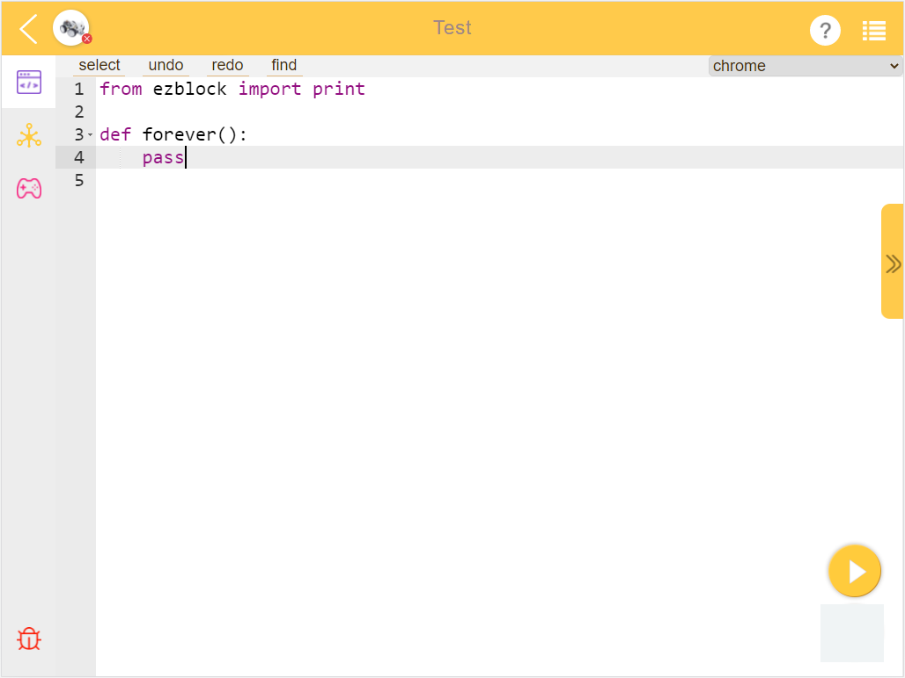

.. _programming_block:

Programmierseite
==========================

Wenn Sie Code schreiben (neues Projekt erstellen, Beispiel bearbeiten, Ihr persönliches Projekt bearbeiten), gelangen Sie zur Programmierseite.
Hier wird die Programmierschnittstelle in der Blockly-Sprache angezeigt. Für die Programmierung in der Python-Sprache siehe :ref:`programming_python`.

.. image:: img/sp210805_143809.png

1. Zurück zur Startseite
2. Ein Produkt auswählen
3. Projektname
4. Hilfe
5. Menü
6. Programmierschnittstelle

7. Fernbedienungsschnittstelle
8. Debug-Monitor

A. Blockkategorien
B. Programmierbereich
C. Ausführen
D. Flash & Ausführen

**Blockkategorien**

.. image:: img/sp210805_151353.png

Finden Sie hier den Codeblock und ziehen Sie ihn in den Programmierbereich, um zu programmieren. Bitte überprüfen Sie die spezifische Verwendung in `Blockreferenz <https://docs.ezblock.cc/en/latest/reference-for-block/block.html>`_.

**Debug-Monitor**

.. image:: img/sp210805_145042.png

Klicken Sie auf das Debug-Symbol in der unteren rechten Ecke, und ein beweglicher Debug-Monitor wird angezeigt. Der Text des **print**-Blocks wird hier angezeigt.

**Hilfe**

.. image:: img/sp210805_150120.png

Nach der Auswahl poppen ezblock-Tutorials auf, einschließlich FAQ, Erste Schritte und `Referenz <https://docs.ezblock.cc/en/latest/reference.html>`_.

**Menü**

.. image:: img/sp210805_150436.png

* **New Project**: Zum Erstellen eines neuen Projekts verwenden.
* **My Projects**: Mit dieser Schaltfläche gelangen Sie zur Seite **My Projects**, um Projekte oder Bibliotheken anzusehen, zu exportieren oder zu importieren.
* **Save**: Fügt das Projekt zu **My Projects** hinzu.
* **Save As**: Das Projekt wird unter einem neuen Dateinamen auf der Seite **My Projects** gespeichert.
* **Create Library**: Erstellen Sie eine Bibliothek, indem Sie die Funktionen im Projekt auswählen. Für ein detailliertes Tutorial siehe: :ref:`library_function_latest`.
* **Import Library**: Die gespeicherte Bibliothek importieren.
* **Save As File**: Speichern Sie im Geräteordner. Das Projekt (``.ezbpro``) wird auf Ihren Computer heruntergeladen, wenn Sie über Webzugriff auf das EzBlock Studio zugreifen. Mit einem mobilen Gerät können Sie das Projekt (``.ezbpro``) im Geräteordner speichern oder es mit der App teilen.

**TIPPS**

Sie können den Programmierbereich oder den Block lange drücken, um einige Hilfsfunktionen zu nutzen.

.. image:: img/sp210805_151819.png

.. list-table:: Menü des Blocks

    * - **Option**
      - **Beschreibung**
    * - Duplicate 
      - Ausgewählte (und dominierte) Blöcke kopieren.
    * - Add/Remove Comment
      - Nach dem Klicken erscheint ein ``?``-Symbol oben rechts im Block, welches dazu dient, Texte zu schreiben, die das Lesen des Codes erleichtern. Diese Texte werden vom Programm nicht ausgeführt.
    * - Expand/Conllapse Block
      - Wenn Ihr Code mehr Blöcke hat, können Sie diese einklappen und bei Bedarf erweitern.
    * - Disable/Enable Block
      - Diese Funktion deaktiviert bestimmte Blöcke, ohne das Programm zu ändern.
    * - Delete `xxx` Blocks
      - Ausgewählte (und dominierte) Blöcke entfernen.
    * - Help
      - 
    * - Create `xxx`
      - Wird in `Vibration`- oder `Funktion`-Blöcken verwendet. Es ermöglicht Ihnen, schnell einen Block zu erstellen, der mit dem ausgewählten Block gekoppelt ist (klicken Sie auf `erstellen` im Funktionsblock, erscheint der Aufrufblock).
    * - Hightlight Function Definition
      - Wird im Aufrufblock der Funktion verwendet und ermöglicht es Ihnen, die Funktionsdefinition zu finden.

.. list-table:: Menü der Programmierseite

    * - **Option**
      - **Beschreibung**
    * - Rückgängig
      - 
    * - Wiederherstellen
      - Rückgängig machen rückgängig
    * - Blöcke aufräumen
      - Die Blöcke ausrichten
    * - Blöcke einklappen
      - Alle Blöcke einklappen
    * - Blöcke erweitern
      - Alle Blöcke erweitern
    * - `xxx` Blöcke löschen
      - Alle Blöcke löschen

.. _programming_python:

Python Programmierseite
---------------------------

Wenn Sie die Python-Sprache beim Erstellen eines Projekts verwenden, können Sie die Python Programmierseite aufrufen.

Zur Fertigstellung Ihres Projekts müssen Sie sich auf die `Python-Referenz <https://docs.ezblock.cc/en/latest/reference-for-python/ezblock.html>`_ beziehen.

Fernsteuerungs-Oberfläche
--------------------------------

Zur Nutzung beachten Sie bitte :ref:`remote_control_latest`.

.. image:: img/sp210805_144019.png

1. Widget-Kategorien
2. Fernsteuerungsbereich

.. image:: img/sp210805_152451.png

Klicken Sie auf das Widget, um das Nachrichtenfeld anzuzeigen. Halten Sie das Widget lange gedrückt oder klicken Sie auf die Löschen-Schaltfläche, um das Widget zu entfernen.

.. list-table:: Widget der Fernsteuerung

    * - **Widget**
      - **Beschreibung**
    * - Joystick
      - Der weiße Punkt ist zentriert, und sowohl die X- als auch die Y-Werte sind 0. Ziehen Sie den weißen Punkt nach rechts, um den X-Wert zu erhöhen; ziehen Sie ihn nach oben, um den Y-Wert zu erhöhen. Die Bereiche von X und Y sind jeweils (-100, 100).
    * - Schieberegler
      - Wenn der weiße Punkt ganz links ist, beträgt der Wert 0. Ziehen Sie den weißen Punkt nach rechts, um den Wert zu erhöhen. Der Bereich liegt zwischen (0, 100).
    * - D-Pad
      - Dies ist eine Steuerung, die aus 4 Tasten besteht. Jede Taste ist unabhängig voneinander. Der Wert der Taste ist 1, wenn sie gedrückt wird, und 0, wenn sie losgelassen wird.
    * - Taste
      - Der Wert beträgt 1, wenn sie gedrückt wird, und 0, wenn sie losgelassen wird.
    * - Schalter
      - Bei EIN beträgt der Wert 1; bei AUS beträgt der Wert 0.
    * - Video
      - Bitte siehe :ref:`video_latest`.
    * - Digitalrohr
      - Es kann ZAHLEN (wie 123,3) oder ZEIT (wie 11:55) wie eine echte vierstellige Digitalanzeige anzeigen.
    * - Tortendiagramm
      - Es wird verwendet, um den Anteil des Teils am Ganzen in der Datenreihe anzugeben. Jeder Datensatz sollte einen ``Namen`` und einen ``Wert`` enthalten.
    * - Balkendiagramm
      - Die Daten mehrerer Objekte können intuitiv zur vergleichenden Analyse angezeigt werden. Jedes Objekt sollte einen ``Namen`` und einen ``Wert`` enthalten.
    * - Liniendiagramm
      - Kontinuierliche Daten mehrerer Objekte können angezeigt werden. Jedes Objekt sollte einen ``Namen`` und einen ``Wert`` enthalten. Die kontinuierliche Datengenerierung basiert auf mehreren Aufrufen (normalerweise unter Verwendung von Schleifen).
    * - Glühbirne
      - Wie die tatsächliche LED leuchtet sie, wenn eine 1 geschrieben wird und erlischt, wenn eine 0 geschrieben wird.
