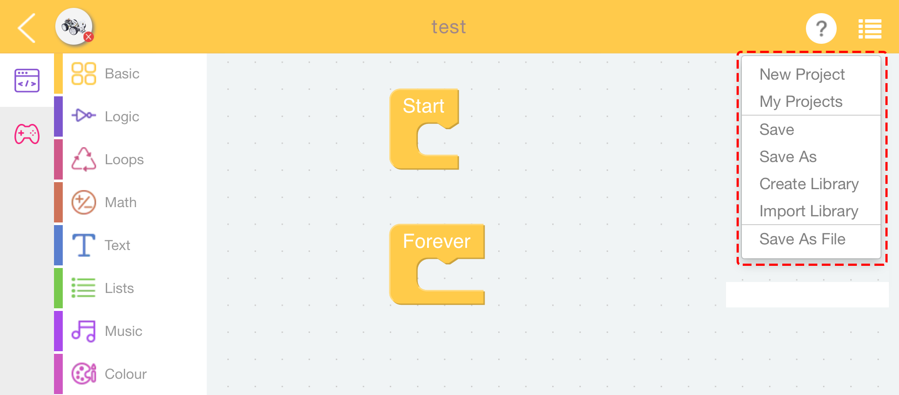
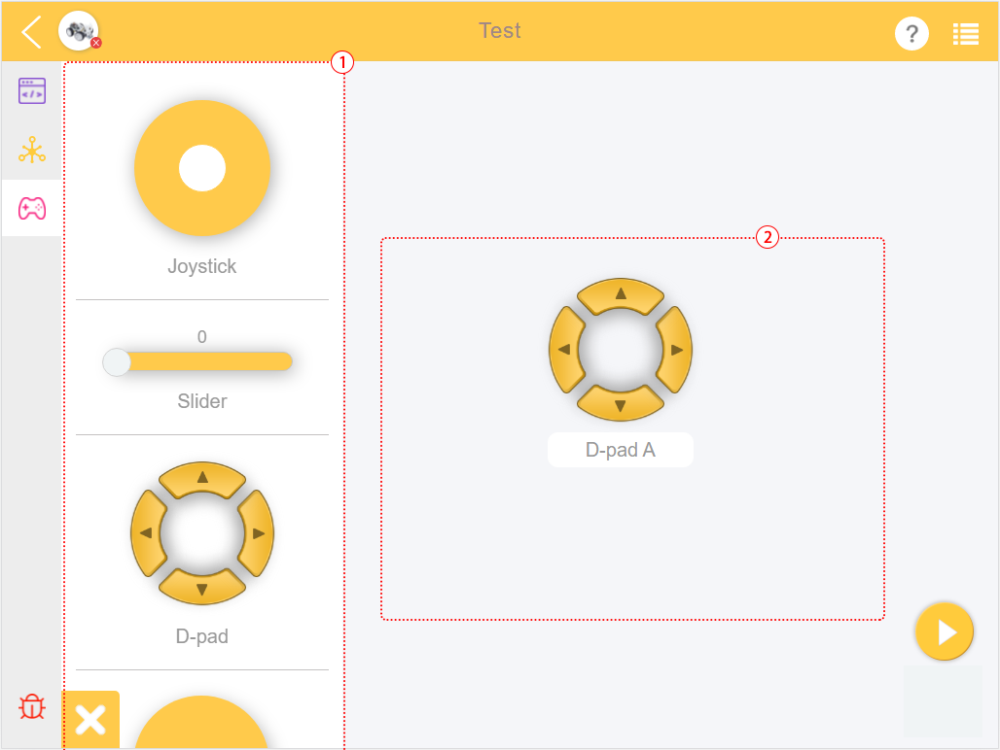

.. note::

    Hello, welcome to the SunFounder Raspberry Pi & Arduino & ESP32 Enthusiasts Community on Facebook! Dive deeper into Raspberry Pi, Arduino, and ESP32 with fellow enthusiasts.

    **Why Join?**

    - **Expert Support**: Solve post-sale issues and technical challenges with help from our community and team.
    - **Learn & Share**: Exchange tips and tutorials to enhance your skills.
    - **Exclusive Previews**: Get early access to new product announcements and sneak peeks.
    - **Special Discounts**: Enjoy exclusive discounts on our newest products.
    - **Festive Promotions and Giveaways**: Take part in giveaways and holiday promotions.

    👉 Ready to explore and create with us? Click [|link_sf_facebook|] and join today!

.. _programming_block:

Programming Page
==========================

When you write code (create new project, edit example, edit your personal project), you will enter the Programming Page.
Shown here is the programming interface in blockly language. For programming in python language, please see :ref:`programming_python`.

.. image:: img/sp210805_143809.png

1. Return to the home page
2. Choose a product
3. Project name
4. Help
5. Menu
6. Programming interface

7. Remote control interface
8. Debug Monitor
    
A. Block Categories
B. Programming Area
C. Run
D. Flash & Run

**Block Categories**

Find the code block from here, and drag the code block into the Programming Area for programming. Please check the specific usage in `Block Reference <https://docs.ezblock.cc/en/latest/reference-for-block/block.html>`_.

**Debug Monitor**

.. image:: img/sp210805_145042.png

Click the debug icon in the lower right corner, and a movable debug monitor will appear. The text of the **print** block will be displayed here.

**Help**

.. image:: img/sp210805_150120.png

After selection, ezblock tutorials will pop up, including FAQ, get started and `reference <https://docs.ezblock.cc/en/latest/reference.html>`_.

**Menu**

* **New Project**: Use to create a new project.
* **My Projects**: Use this button to go to the **My Projects** page to view, export or import projects or libraries.
* **Save**: Adds the project to **My Projects**.
* **Save As**: The project is saved to the **My Projects** page as a new file name.
* **Create Library**: To create a library by selecting the functions in the project. For a detailed tutorial, please refer to: :ref:`library_function_latest`.
* **Import Library**: Import the saved library.
* **Save As File**: Save to the device's folder. The project (``.ezbpro``) is downloaded to your computer if you are using Web access to EzBlock Studio. With a mobile device, you can save the project (``.ezbpro``) to the device folder or share it with the app.

**TIPS**

You can long press the programming area or block to use some auxiliary functions.

.. image:: img/sp210805_151610.png
.. image:: img/sp210805_151819.png

.. list-table:: Menu of Block

    * - **Option**
      - **Description**
    * - Duplicate 
      - Copy selected (and dominated by) blocks.
    * - Add/Remove Comment
      - After clicking, a ``?`` icon will appear at the top right of the block, which is used to write text that is helpful for reading the code. These texts will not be executed by the program.
    * - Expand/Conllapse Block
      - When your code has more blocks, you can collapse them and expand them when necessary.
    * - Disable/Enable Block
      - This function disables specific blocks without changing the program.
    * - Delete `xxx` Blocks
      - Remove selected (and dominated by) blocks.
    * - Help
      - 
    * - Create `xxx`
      - Used in `Vibration` or `Function` blocks. It enables you to quickly create a block paired with the selected block (click `create` from the Function block, the call block appears).
    * - Hightlight Function Definition
      - Used in the call block of funtion, allows you to find the funtion definition

.. list-table:: Menu of Programming Page

    * - **Option**
      - **Description**
    * - Undo
      - 
    * - Redo
      - Cancel Undo
    * - Clean up Blocks
      - Align the blocks
    * - Conllapse Blocks
      - Collapse all blocks
    * - Expand Blocks
      - Expand all blocks
    * - Delete `xxx` Blocks
      - Delete all blocks

.. _programming_python:

Python Programming Page
---------------------------

If you use python language when creating a project, you can enter the Python Programming Page.

.. image:: img/sp210805_154924.png

You will need to refer to `Python Reference <https://docs.ezblock.cc/en/latest/reference-for-python/ezblock.html>`_ to complete your project.

Remote Control Interface
--------------------------------

For how to use it, please see :ref:`remote_control_latest`

1. Widget Categories
2. Remote Control Area

Click on the widget to display the message box, long press the widget or click the delete button to delete the widget.

.. list-table:: Widget of Remote Control

    * - **Widget**
      - **Description**
    * - Joystick
      - The white dot is centered, and both X and Y values are 0. Drag the white point to the right to increase the X value; drag it upwards to increase the Y value. The ranges of X and Y are both (-100, 100).
    * - Slider
      - When the white point is on the far left, the value is 0. Drag the white point to the right to increase the value. The range is (0, 100).
    * - D-Pad
      - This is a control composed of 4 Buttons, each button is independent of each other. The value of the Button is 1 when it is pressed and 0 when it is released.
    * - Button
      - The value is 1 when pressed and 0 when released.
    * - Switch
      - When ON, the value is 1; when OFF, the value is 0.
    * - Video
      - Please check :ref:`video_latest`
    * - Digital Tube
      - It can display NUMBER (such as 123.3) or TIME (such as 11:55) like a real four-digit digital tube.
    * - Pie Chart
      - It is used to indicate the proportion of the part and the whole in the data series. Each set of data should include a ``name`` and ``value``.
    * - Bar Chart
      - The data of multiple objects can be displayed intuitively for comparative analysis. Each object should include a ``name`` and ``value``.
    * - Line Chart
      - Continuous data of multiple objects can be displayed. Each object should include a ``name`` and ``value``. Continuous data generation is based on multiple calls (usually, using loops).
    * - Bulb
      - Like the actual LED, it lights up when 1 is written, and turns off when 0 is written.