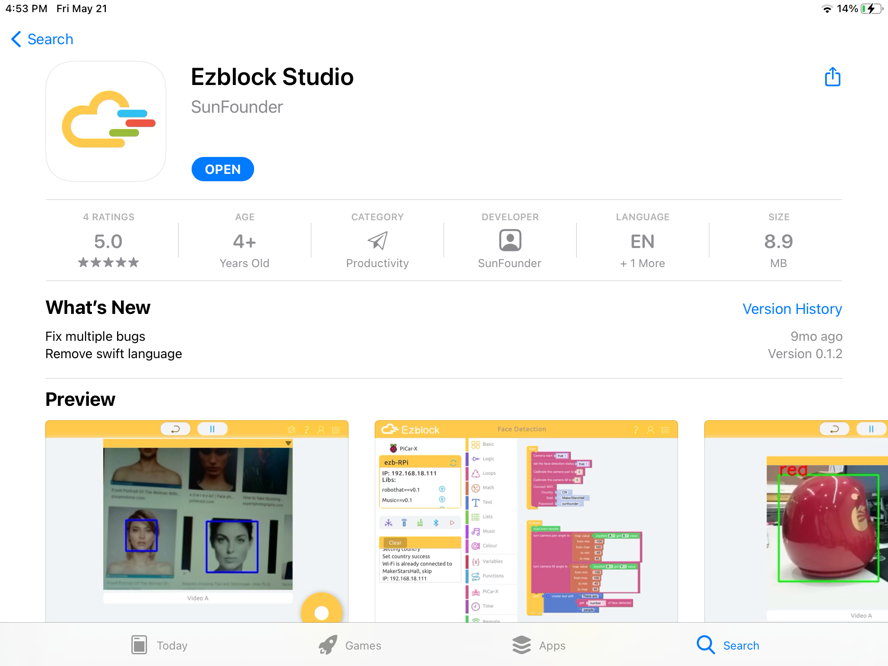

.. note::

    Hallo und willkommen in der SunFounder Raspberry Pi & Arduino & ESP32 Enthusiasten-Gemeinschaft auf Facebook! Tauchen Sie tiefer ein in die Welt von Raspberry Pi, Arduino und ESP32 mit anderen Enthusiasten.

    **Warum beitreten?**

    - **Expertenunterstützung**: Lösen Sie Nachverkaufsprobleme und technische Herausforderungen mit Hilfe unserer Gemeinschaft und unseres Teams.
    - **Lernen & Teilen**: Tauschen Sie Tipps und Anleitungen aus, um Ihre Fähigkeiten zu verbessern.
    - **Exklusive Vorschauen**: Erhalten Sie frühzeitigen Zugang zu neuen Produktankündigungen und exklusiven Einblicken.
    - **Spezialrabatte**: Genießen Sie exklusive Rabatte auf unsere neuesten Produkte.
    - **Festliche Aktionen und Gewinnspiele**: Nehmen Sie an Gewinnspielen und Feiertagsaktionen teil.

    👉 Sind Sie bereit, mit uns zu erkunden und zu erschaffen? Klicken Sie auf [|link_sf_facebook|] und treten Sie heute bei!

.. _install_ezblock_app_latest:

EzBlock Studio installieren
==============================

**EzBlock Studio** ist eine App zur Programmierung und Steuerung von SunFounder Raspberry Pi Robotern. Sie ermöglicht Anfängern (Schülern) einen schnellen Einstieg in die Raspberry Pi Roboter-Programmierung. Sie verfügt über eingebaute TTS, Kameraerkennung, Fernsteuerung, Musik-/Soundeffekte und Sensorensteuerungsfunktionen.

Öffnen Sie den App Store (**iOS**) oder den Play Store (**Android**) und suchen und laden Sie **EzBlock Studio** herunter.

Benutzer von Linux/Mac OS X und Windows können EzBlock Studio in einem Browser verwenden. Weitere Informationen finden Sie unter :ref:`use_on_web_latest`.

