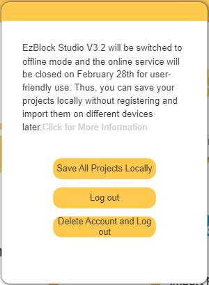

Save Your Project in time (For Old Users)
===============================================

.. note::
    On February 28, 2023, all accounts and items stored in your account will be cleared and can not be retrieved. Sorry for the inconvenience caused.

When you log into your account, you will see a pop-up prompt.

* If you want to save your project locally, please click ``Save All Project Locally``, it will take you a minute, and then you will be able to access your project directly without logging in.

* Click ``Log out`` if you do not want to transfer items saved to the online service at this time. You can still transfer your items the next time you log in.

* If you no longer need the items saved to the online service, you can click ``Delete Account and Log out``.
