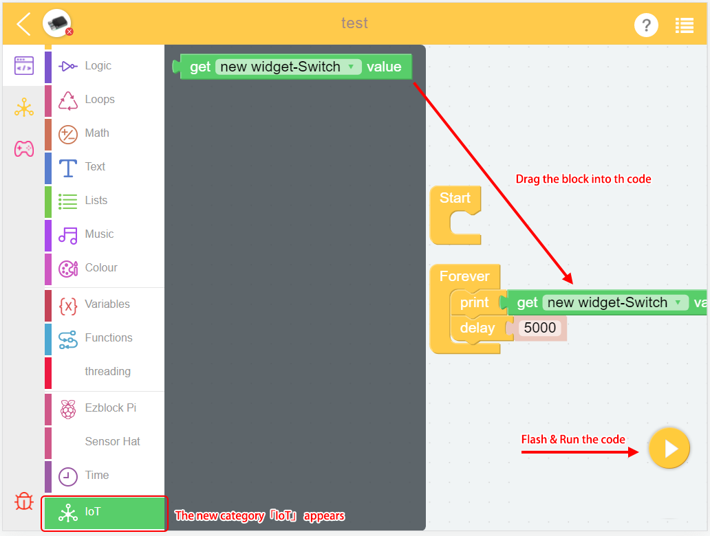

How to Use IoT Function?
========================================

IoT Function allows you to use devices at home through the World Wide Web. For example, use your mobile phone to check the home temperature or turn off the lights when you are out.

1. Enter the **IoT Page**.

2. This function can only be used after logging in.

3. Click "+".

4. Choose the applicable widget.

5. Go back to **Programming Page**, you can see the new block appears. Complete your code please.

6. After you run the code, go back to the **IoT Page**, play it.

