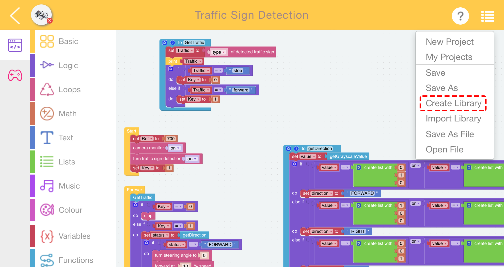

.. _library_function_latest:

如何使用库功能？
======================================

当你需要在多个项目中重复使用相同的代码时，你可以在菜单中使用库功能。

编写函数后，点击菜单中的创建库，并选择你想要的函数。

.. image:: img/create_libraries.png

为你的库填写一个描述。

.. image:: img/sp210805_150848.png

在使用时，点击 **Import Library** 中的 **Menu**。找到你想要的库，然后点击 **Import**。

.. image:: img/sp210805_151150.png

结果如下。您可以点击展开块来查看函数的内容。

.. image:: img/sp210805_151105.png

