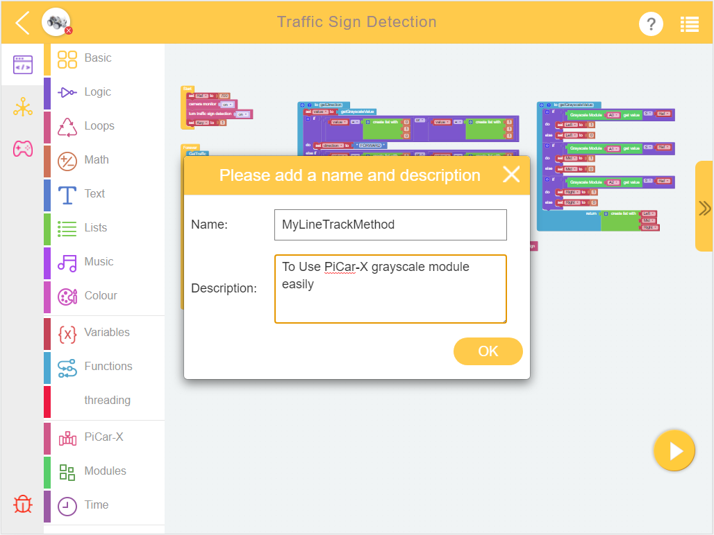
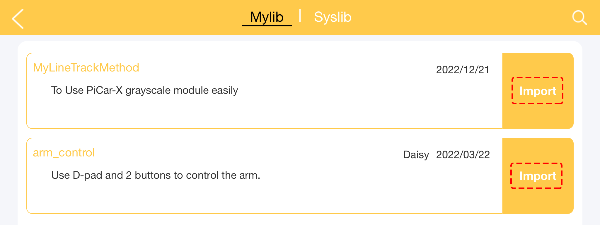

.. note::

    Hello, welcome to the SunFounder Raspberry Pi & Arduino & ESP32 Enthusiasts Community on Facebook! Dive deeper into Raspberry Pi, Arduino, and ESP32 with fellow enthusiasts.

    **Why Join?**

    - **Expert Support**: Solve post-sale issues and technical challenges with help from our community and team.
    - **Learn & Share**: Exchange tips and tutorials to enhance your skills.
    - **Exclusive Previews**: Get early access to new product announcements and sneak peeks.
    - **Special Discounts**: Enjoy exclusive discounts on our newest products.
    - **Festive Promotions and Giveaways**: Take part in giveaways and holiday promotions.

    👉 Ready to explore and create with us? Click [|link_sf_facebook|] and join today!

.. _library_function_latest:

How to Use Library Function?
======================================

When you need to reuse the same code in multiple projects, you can use the library function in the menu.

.. image:: img/sp210809_111713.png

After writing the function, click create library in the Menu and select the function you want.

.. image:: img/create_libraries.png

Fill in a description for your library.

When using it, click **Import Library** in the **Menu**. Find the one you want and click on **Import**.

The results are as follows. You can click Expand Block to see the content of the function.

.. image:: img/sp210805_151105.png

