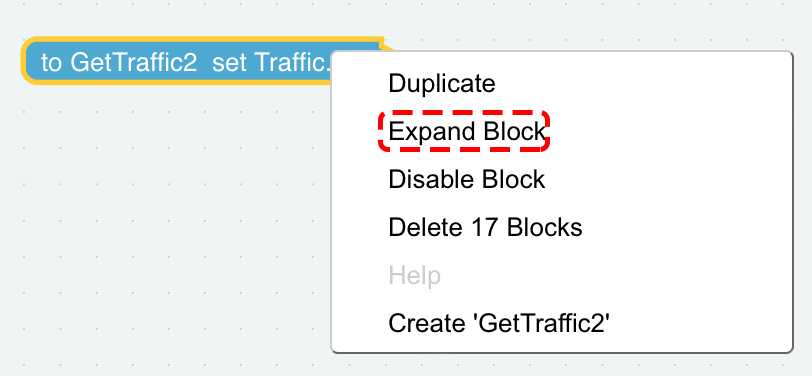

.. note::

    Hallo und willkommen in der SunFounder Raspberry Pi & Arduino & ESP32 Enthusiasten-Gemeinschaft auf Facebook! Tauchen Sie tiefer ein in die Welt von Raspberry Pi, Arduino und ESP32 mit anderen Enthusiasten.

    **Warum beitreten?**

    - **Expertenunterstützung**: Lösen Sie Nachverkaufsprobleme und technische Herausforderungen mit Hilfe unserer Gemeinschaft und unseres Teams.
    - **Lernen & Teilen**: Tauschen Sie Tipps und Anleitungen aus, um Ihre Fähigkeiten zu verbessern.
    - **Exklusive Vorschauen**: Erhalten Sie frühzeitigen Zugang zu neuen Produktankündigungen und exklusiven Einblicken.
    - **Spezialrabatte**: Genießen Sie exklusive Rabatte auf unsere neuesten Produkte.
    - **Festliche Aktionen und Gewinnspiele**: Nehmen Sie an Gewinnspielen und Feiertagsaktionen teil.

    👉 Sind Sie bereit, mit uns zu erkunden und zu erschaffen? Klicken Sie auf [|link_sf_facebook|] und treten Sie heute bei!

.. _library_function_latest:

Wie nutzt man die Bibliotheksfunktion?
======================================

Wenn Sie denselben Code in mehreren Projekten wiederverwenden möchten, können Sie die Bibliotheksfunktion im Menü verwenden.

.. image:: img/sp210809_111713.png

Nachdem Sie die Funktion verfasst haben, klicken Sie im Menü auf Bibliothek erstellen und wählen die gewünschte Funktion aus.

.. image:: img/create_libraries.png

Geben Sie eine Beschreibung für Ihre Bibliothek ein.

.. image:: img/sp210805_150848.png

Um sie zu verwenden, klicken Sie im **Menu** auf **Import Library**. Finden Sie die gewünschte und klicken auf **Import**.

.. image:: img/sp210805_151150.png

Die Ergebnisse sehen wie folgt aus. Sie können auf Block erweitern klicken, um den Inhalt der Funktion zu sehen.

